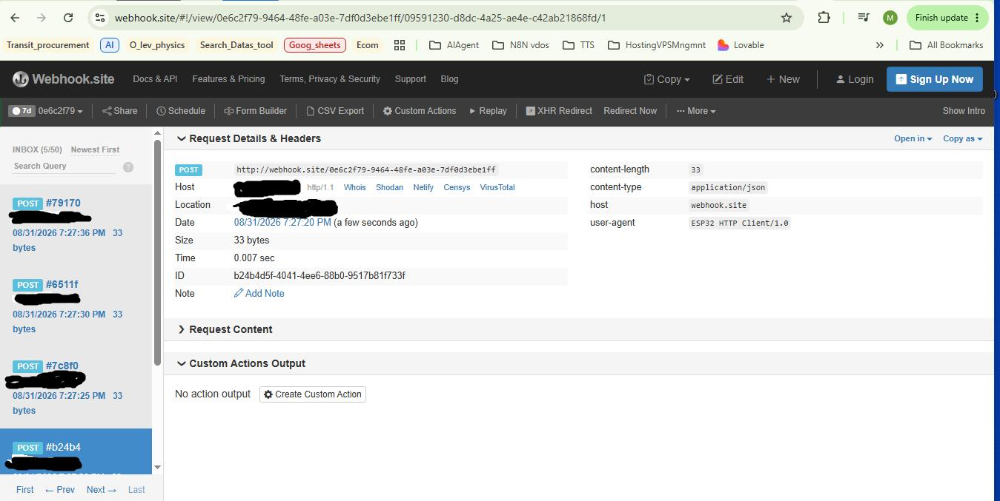

# ESP32-S3 TFLite Camera Trigger

**Edge AI detection pipeline — camera to cloud, proven on real hardware**

[](https://docs.espressif.com/projects/esp-idf/)
[](https://github.com/espressif/esp-tflite-micro)
[]()
[](LICENSE)

> OV3660 camera → TFLite Micro inference → WiFi → HTTP POST → cloud. End-to-end on Seeed Xiao ESP32-S3 Sense. Trigger confirmed received at webhook.site.

---

## What it is

A complete edge AI detection pipeline running on the ESP32-S3. The camera captures frames continuously. TFLite Micro runs inference on-device. When a detection clears the confidence threshold, the pipeline reconnects WiFi and fires an HTTP POST trigger to a cloud endpoint — without any external server, without a desktop, and without a GPU.

The primary goal is to demonstrate the full embedded AI → cloud trigger chain on constrained hardware. Every stage is measured on real silicon, not simulated.

---

## Cloud trigger confirmed

The screenshot below shows webhook.site receiving the HTTP POST from the ESP32-S3 in real time. The `user-agent: ESP32 HTTP Client/1.0` header confirms the sender. Multiple triggers visible in the inbox — the pipeline fires reliably across detection events.



**Payload received:**
```json
{"class_id": 1, "confidence": 0.672}
```

**Response time: 0.007 seconds.**

---

## Hardware

| Component | Details |
|---|---|
| Board | Seeed Xiao ESP32-S3 Sense |
| Silicon | ESP32-S3 (revision v0.2), dual-core Xtensa LX7 |
| Camera | OV3660 via DVP ribbon FPC |
| Flash | 8 MB (W25Q64) |
| PSRAM | 8 MB OPI (octal SPI, 80 MHz) |
| WiFi | 802.11 b/g/n 2.4 GHz, WPA2/WPA3 |

---

## Architecture

```
┌─────────────────────────────────────────────────────────────────┐
│  CPU0                          │  CPU1                          │
│  WiFi ISRs + TCP/IP stack      │  detect_task (pinned)          │
│                                │                                │
│  boot: wifi_connect()          │  WiFi stop (inference mode)    │
│        camera_init()           │      ↓                         │
│        inference_init()        │  camera_capture_frame()        │
│        create detect_task →    │      ↓                         │
│                                │  inference_run()               │
│                                │    RGB565 → grayscale → 96×96  │
│                                │    TFLite Micro Invoke()       │
│                                │      ↓ [91ms uninterrupted]    │
│                                │  if detection_valid:           │
│                                │    WiFi resume                 │
│                                │    wait for IP (~3.8s)         │
│                                │    trigger_send() → cloud      │
│                                │    WiFi stop                   │
│                                │  else: next frame immediately  │
└─────────────────────────────────────────────────────────────────┘
```

**WiFi pause pattern:** WiFi ISRs on CPU0 preempt the convolution kernel on CPU1 via crosscore interrupts, preventing Invoke() from completing. WiFi is stopped during inference only — the rest of the pipeline runs with WiFi active. Non-detection frames run at maximum throughput with no WiFi reconnect overhead.

**Inference mode flag:** `wifi_set_inference_mode(true)` suppresses the persistent WiFi event handler's auto-reconnect when WiFi is intentionally stopped. Without this, `esp_wifi_stop()` triggers a reconnect loop that defeats the pause.

---

## Measured performance (real hardware)

| Metric | Value | Conditions |
|---|---|---|
| Invoke() duration | **91.2 ms mean** | WiFi stopped, SRAM arena, CPU1, FREERTOS_HZ=5 |
| Invoke() variance | **±0.05 ms** | Across 50+ measurements |
| WiFi reconnect | **3,600–3,800 ms** | connect() → IP assigned, DHCP dominant |
| Detection confidence | **0.63–0.93** | Person detection, QQVGA RGB565 input |
| Full cycle (no detect) | **~200 ms** | Camera capture + Invoke(), no WiFi |
| Full cycle (detection) | **~5 s** | + WiFi reconnect + HTTP POST |

**Key finding:** PSRAM-backed tensor arena combined with WiFi activity causes Invoke() to stall indefinitely via crosscore cache coherency interrupts. Moving the arena to internal SRAM and stopping WiFi during Invoke() resolves it completely.

---

## Key engineering decisions

Six decisions derived from empirical observation, not assumption:

1. **RGB565 over JPEG.** JPEG DMA buffer allocation underestimates real-scene compressed output, causing persistent frame buffer overflow. RGB565 is deterministic: `160×120×2 = 38,400 bytes` exact.

2. **Direct RGB565 → grayscale conversion.** Eliminates the intermediate 57,600-byte RGB888 buffer. Bulk PSRAM writes from CPU1 trigger crosscore ISRs from CPU0 WiFi — degrading inference. Scattered 16-bit reads (9,216 total for 96×96) generate negligible cache pressure.

3. **Tensor arena in internal SRAM.** PSRAM arena + WiFi active = indefinite Invoke() stall confirmed by watchdog at 60s intervals. Internal SRAM at 160 MHz, no bus contention. Measured: 122,580 bytes of 130 KB allocated.

4. **CPU affinity — inference on CPU1.** WiFi ISRs register to CPU0. Pinning detect_task to CPU1 via `xTaskCreatePinnedToCore()` eliminates direct ISR preemption.

5. **WiFi pause during Invoke().** FreeRTOS tick crosscore ISRs and WiFi beacon events still preempt CPU1 even when the WiFi task is not running. `esp_wifi_stop()` is required. FREERTOS_HZ=5 (200ms tick) also applied.

6. **Inference mode flag.** `esp_wifi_stop()` triggers `WIFI_EVENT_STA_DISCONNECTED`, which the persistent handler retries indefinitely — defeating the pause. `wifi_set_inference_mode(true)` suppresses this when the stop is intentional.

---

## Flash memory build-up

| Stage | Binary | Headroom | Delta source |
|---|---|---|---|
| Stub — all modules | 214 KB | 90% | baseline |
| Camera module | 318 KB | 84% | esp32-camera driver |
| Inference + model | 706 KB | 66% | TFLite Micro + person detect model |
| Full pipeline | 1,325 KB | 34% | WiFi stack + lwIP + esp_http_client |

---

## WiFi authentication — community note

`threshold.authmode` is a security floor with no auto-negotiate across WPA/WPA2/WPA3. `WIFI_AUTH_OPEN` removes the floor — firmware auto-elevates based on password length. Confirmed on WPA2 router and WPA3 Android hotspot. Forward-compatible with future protocols.

---

## Quick start

### Prerequisites

- ESP-IDF v5.0 or later
- Seeed Xiao ESP32-S3 Sense with OV3660 camera module

### Build and flash

```bash
git clone https://github.com/SysEngg-786/esp32s3-tflite-camera-trigger.git
cd esp32s3-tflite-camera-trigger

idf.py set-target esp32s3
idf.py menuconfig
# Set: ESP32S3 TFLite Camera Trigger Configuration
#   WiFi SSID, Password, HTTP trigger endpoint URL

idf.py build flash monitor
```

### Expected output

```
I (5152) main: all modules initialised — detection task running on CPU1
I (5152) main: detection_task: stopping WiFi for inference loop
I (5352) main: inference: 91157 us (91 ms) — valid=0 confidence=0.27
...
I (8752) main: inference: 91155 us (91 ms) — valid=1 confidence=0.89
I (8752) main: detection: class=1 confidence=0.89 — reconnecting WiFi
I (12552) main: wifi ready after 3773 ms — sending trigger
I (12552) trigger: trigger_send: POST https://... HTTP 200
I (12552) main: trigger complete — resuming inference loop
```

---

## Repository structure

```
esp32s3-tflite-camera-trigger/
├── main/
│   ├── camera/          — OV3660 init, frame capture (RGB565)
│   ├── inference/       — TFLite Micro runner, direct RGB565→grayscale
│   ├── trigger/         — WiFi station, inference mode flag, HTTP POST
│   ├── model/           — Person detection model C array
│   └── main.cpp         — Orchestration, CPU affinity, WiFi lifecycle
├── tests/
│   └── wifi_sta/        — Isolated WiFi diagnostic project
├── training/            — Reserved: ML training pipeline (phase 2)
├── docs/
│   ├── images/
│   ├── Technical_Implementation_Guide.md
│   └── Deployment_Pipeline_Guide.md
├── partitions.csv       — 8MB flash layout
└── sdkconfig.defaults   — Hardware baseline for Xiao ESP32-S3 Sense
```

---

## Research extension

Benchmark paper planned on co-scheduling TFLite Micro inference with WiFi on dual-core ESP32-S3. Four controlled experiments defined — see `docs/dev/` for the scheduling research notes and parameter change log.

---

## License

MIT — see [LICENSE](LICENSE) for details.
