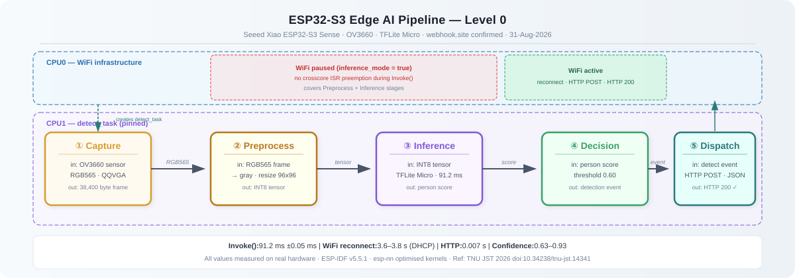

# ESP32-S3 TFLite Camera Trigger

**Edge AI detection pipeline — camera to cloud, proven on real hardware**

[](https://docs.espressif.com/projects/esp-idf/)
[](https://github.com/espressif/esp-tflite-micro)
[]()
[](LICENSE)

> OV3660 camera → TFLite Micro inference → WiFi → HTTP POST → cloud.
> End-to-end on Seeed Xiao ESP32-S3 Sense. Trigger confirmed at webhook.site.

---

## Pipeline — Level 0



Five sequential stages on CPU1. WiFi infrastructure on CPU0, paused only during
inference to eliminate crosscore ISR preemption. Left-to-right = time.
All values measured on real hardware — not estimated.

---

## Cloud trigger confirmed

The screenshot below shows webhook.site receiving the HTTP POST from the ESP32-S3
in real time. The `user-agent: ESP32 HTTP Client/1.0` header confirms the sender.
Multiple triggers visible in the inbox — the pipeline fires reliably.


**Payload received:**
```json
{"class_id": 1, "confidence": 0.672}
```
**Response time: 0.007 s · timestamp: 31-Aug-2026 14:27:20**

---

## Hardware

| Component | Details |
|---|---|
| Board | Seeed Xiao ESP32-S3 Sense |
| Silicon | ESP32-S3 rev v0.2 · dual-core Xtensa LX7 · 240 MHz |
| Camera | OV3660 · DVP ribbon FPC |
| Flash | 8 MB (W25Q64) |
| PSRAM | 8 MB OPI (octal SPI · 80 MHz) |
| WiFi | 802.11 b/g/n 2.4 GHz · WPA2/WPA3 |

---

## Measured performance (real hardware)

| Metric | Value | Conditions |
|---|---|---|
| Invoke() duration | **91.2 ms mean ±0.05 ms** | WiFi stopped · SRAM arena · CPU1 · FREERTOS_HZ=5 |
| WiFi reconnect | **3.6–3.8 s** | connect() → IP assigned · DHCP dominant |
| HTTP response | **0.007 s** | webhook.site · plain HTTP |
| Detection confidence | **0.63–0.93** | person present · QQVGA RGB565 input |
| Full cycle (no detect) | **~200 ms** | capture + Invoke() · no WiFi |
| Full cycle (detection) | **~5 s** | + WiFi reconnect + HTTP POST |

**Community reference:** TNU Journal of Science and Technology Vol.231 Feb 2026
([doi:10.34238/tnu-jst.14341](https://doi.org/10.34238/tnu-jst.14341)) —
MobileNetV1-α0.1 at 95 ±3.4 ms on same hardware (ESP32 XIAO S3, OV3660,
TFLite Micro, 96×96×1, Visual Wake Words). Our 91.2 ms validates directly
against this independent measurement.

---

## Key engineering decisions

Six decisions derived from empirical observation — each documented with
the problem it solved, the failed approaches, and the confirmed result.

**1. RGB565 over JPEG.**
JPEG DMA buffer allocation underestimates real-scene compressed output size,
causing persistent `cam_hal: FB-OVF` regardless of quality setting.
RGB565 is deterministic: `160×120×2 = 38,400 bytes` exact — no overflow possible.

**2. Direct RGB565 → grayscale conversion.**
Eliminates `fmt2rgb888()` and the 57,600-byte intermediate RGB888 buffer.
Bulk PSRAM writes from CPU1 trigger crosscore cache coherency ISRs from
CPU0 WiFi access, degrading inference. Scattered 16-bit reads (9,216 per
96×96 frame) generate negligible cache pressure.

**3. Tensor arena in internal SRAM.**
PSRAM arena + WiFi active = indefinite Invoke() stall confirmed by watchdog
at 60s intervals. Internal SRAM at 160 MHz, single-cycle access, no bus
contention. Measured: 122,580 bytes used of 130 KB allocated.

**4. Inference task pinned to CPU1.**
WiFi ISRs register to CPU0 (the init core). `xTaskCreatePinnedToCore(..., 1)`
separates inference from WiFi ISR traffic at the hardware level.

**5. WiFi pause during Invoke().**
FreeRTOS tick crosscore ISRs and WiFi beacon events preempt CPU1
regardless of task pinning. `esp_wifi_stop()` is required before
`inference_run()`. `FREERTOS_HZ=5` (200ms tick) also applied.

**6. Inference mode flag.**
`esp_wifi_stop()` triggers `WIFI_EVENT_STA_DISCONNECTED`, which the
persistent event handler retries indefinitely — defeating the WiFi pause.
`wifi_set_inference_mode(true)` suppresses auto-reconnect when the stop
is intentional. Must be set before stop and cleared before restart.

---

## WiFi authentication — community finding

`threshold.authmode` in `wifi_config.sta` is a security floor with no
auto-negotiate option across WPA/WPA2/WPA3. `WIFI_AUTH_OPEN` removes
the floor — the firmware auto-elevates based on password length
(logged: `authmode threshold changes from OPEN to WPA2`).
Confirmed on WPA2 router (WPA2-PSK negotiated) and WPA3 Android hotspot
(WPA3-SAE negotiated) with the same firmware, no code change.
Forward-compatible with future protocol generations.

---

## Flash memory build-up

Binary grows with each component integrated — measured at each commit:

| Stage | Binary | Headroom | Added by |
|---|---|---|---|
| Stub — all modules | 214 KB | 90% | baseline |
| + Camera module | 318 KB | 84% | esp32-camera driver |
| + Inference + model | 706 KB | 66% | TFLite Micro + person detect model |
| + Full pipeline | 1,325 KB | 34% | WiFi stack + lwIP + esp_http_client |

---

## Quick start

### Prerequisites

- ESP-IDF v5.0 or later (`idf.py --version`)
- Seeed Xiao ESP32-S3 Sense with OV3660 camera ribbon attached

### Build and flash

```bash
git clone https://github.com/SysEngg-786/esp32s3-tflite-camera-trigger.git
cd esp32s3-tflite-camera-trigger

idf.py set-target esp32s3
idf.py menuconfig
# Set: ESP32S3 TFLite Camera Trigger Configuration
#   → WiFi SSID      (tip: use WIFI_AUTH_OPEN for automatic WPA/WPA2/WPA3)
#   → WiFi Password
#   → HTTP trigger endpoint URL  (e.g. http://webhook.site/your-uuid)

idf.py build flash monitor
```

### Expected output

```
I (5152) main: all modules initialised — detection task running on CPU1
I (5152) main: detection_task: stopping WiFi for inference loop
I (5352) main: inference: 91157 us (91 ms) — valid=0 confidence=0.27
I (5552) main: inference: 91263 us (91 ms) — valid=0 confidence=0.15
I (8752) main: inference: 91155 us (91 ms) — valid=1 confidence=0.89
I (8752) main: detection: class=1 confidence=0.89 — reconnecting WiFi
I (12552) main: wifi ready after 3773 ms — sending trigger
I (12552) trigger: trigger_send: POST http://webhook.site/... HTTP 200
I (12552) main: trigger complete — resuming inference loop
```

---

## Repository structure

```
esp32s3-tflite-camera-trigger/
├── README.md
├── main/
│   ├── camera/          — OV3660 init, RGB565 frame capture
│   ├── inference/       — TFLite Micro, direct RGB565→grayscale, SRAM arena
│   ├── trigger/         — WiFi station, inference mode flag, HTTP POST
│   ├── model/           — Person detect model C array (MobileNet INT8)
│   └── main.cpp         — Orchestration, CPU affinity, WiFi lifecycle
├── tests/
│   └── wifi_sta/        — Isolated WiFi diagnostic project
│                          Espressif reference pattern, hardcoded credentials,
│                          used to isolate WiFi stack from camera/inference code
├── docs/
│   ├── images/
│   │   ├── esp32s3_pipeline_level0.svg   — pipeline diagram (SVG, GitHub renders inline)
│   │   ├── esp32s3_pipeline_level0.png   — pipeline diagram (PNG, for external use)
│   │   ├── esp32s3_pipeline_level1.svg   — detailed reference diagram
│   │   └── esp32s3_edge_ai_cloud_trigger.jpg  — cloud trigger screenshot
│   ├── Technical_Implementation_Guide.md
│   └── Deployment_Pipeline_Guide.md
├── partitions.csv       — 8MB flash layout (factory 2MB, SPIFFS 4MB)
└── sdkconfig.defaults   — Hardware baseline for Xiao ESP32-S3 Sense
```

**Diagram formats:**
- `.svg` — stored in repo, renders inline on GitHub README, editable as text
- `.png` — 2×resolution raster export for Upwork portfolio, LinkedIn, slide decks

---

## Research extension

Benchmark paper in progress — co-scheduling TFLite Micro inference with WiFi
on dual-core ESP32-S3. Four planned controlled experiments:

1. Invoke() duration vs FREERTOS_HZ — tick rate effect on inference time
2. WiFi reconnect characterization — connect-to-IP latency distribution
3. Format comparison — JPEG vs RGB565 at QQVGA and QVGA
4. Arena location — PSRAM vs internal SRAM under WiFi load

All experiments run as single-variable controlled tests.
Results will be published as the community reference for this stack.

---

## License

MIT — see [LICENSE](LICENSE) for details.
